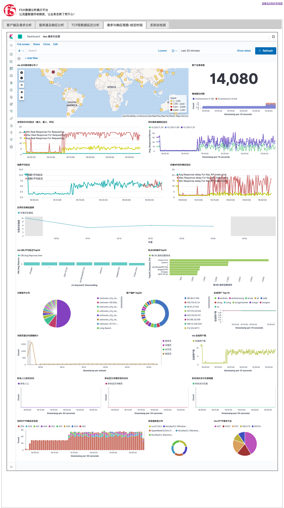
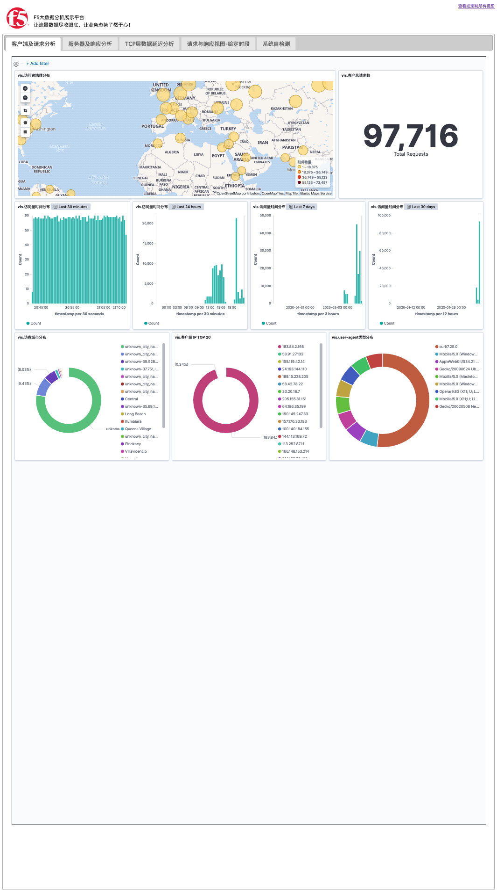
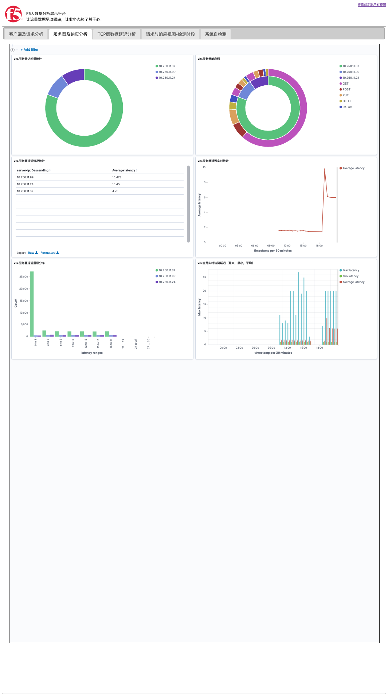
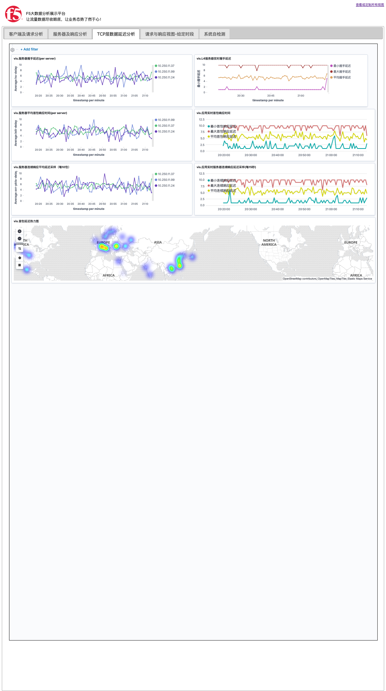
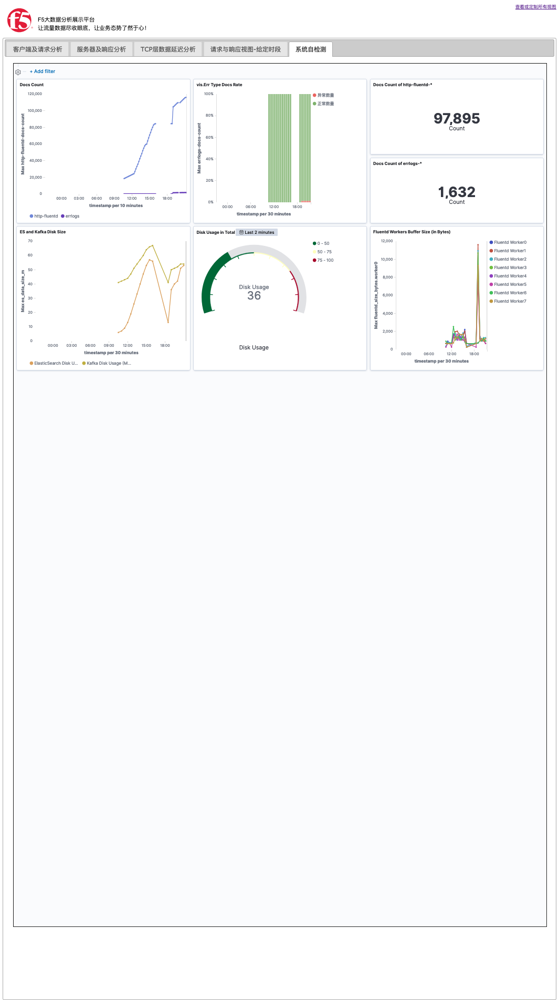

## ScreenShots

This folder is used to place related screenshots as examples.

# page '请求与响应视图-给定时段'

This page contains dashboards about information about requests and responses.

# Page '客户端与请求分析'

This page contains dashboards about clients & requests, including geo, count, city, etc.

# Page '服务器与响应分析'

This page contains dashboards about servers & responses, 

# Page 'TCP层数据延迟分析'

This page contains dashboards about tcp traffic information: latency for handshake, initial and contineous package traffic. 

# Page '系统自监控'

This page is used to show the platform's health information.

